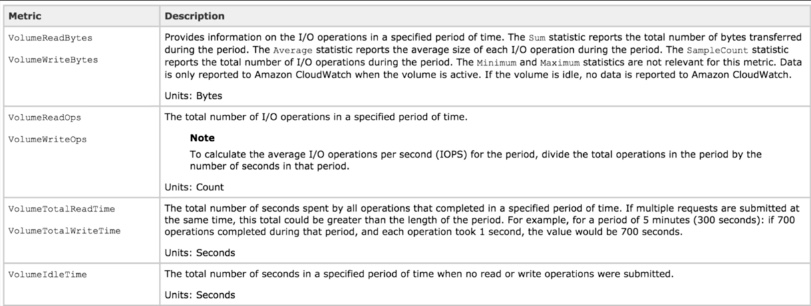

## Documents:
[Exam Blueprint](https://d1.awsstatic.com/training-and-certification/docs-sysops-associate/AWS%20Certified%20SysOps%20-%20Associate_Exam%20Guide_Sep18.pdf)

[Initializing Amazon EBS volumes](https://docs.aws.amazon.com/AWSEC2/latest/UserGuide/ebs-initialize.html)

[Monitoring the status of your volumes](https://docs.aws.amazon.com/AWSEC2/latest/UserGuide/monitoring-volume-status.html)

| Objective | % of Examination | 
| -------- | -------- | 
|Domain 1: Monitoring and Reporting |22% |
|Domain 2: High Availability |8% |
|Domain 3: Deployment and Provisioning  | 14%|
|Domain 4: Storage and Data Management  |12% |
|Domain 5: Security and Compliance |18% |
|Domain 6: Networking  |14% |
|Domain 7: Automation and Optimization |12% |
|**TOTAL**  |**100%** |

## Monitoring and Reporting

### Cloud Watch
- A cloud watch is a monitroing service to monitor AWS resources,as well as well as applications that run on AWS.

- CloudWatch can monitor things like:
  - Compute
     - Autoscaling groups
     - Elastic Load Balancers
     - Route53 Health Checks
  - Storage and Content Delivery
     - EBS Volumes
     - Storage Gateways
     - CloudFront
  - Databases and Analytics
     - DynamoDB
     - Elasticache Nodes
     - RDS Instances
     - Elastic MapReduce Job Flows
     - Redshift      

  - Other
     - SNS(Simple Notification Service) Topics
     - SQS(Simple Queue Service) Queues
     - Opsworks
     - CloudWatch Logs
     - Estimated charges on your AWS Bill 

  - Host Level Metrics always consists of:
     - CPU
     - Network
     - Disk
     - Status Check

  :sparkles: :sparkles: RAM utilization 
  It is a custom metric! By default EC2 monitoring is 5 minute intervals, unless you enable detailed monitoring which will then make it 1 minute intervals.

  :sparkles: :sparkles: Metric Granularity
   - 1 minute for detailed monitoring
   - 5 minutes for standard monitoring
  
  :sparkles: :sparkles: CloudWatch can be used on premise - Not restricted to just AWS resources. Can be on premise too. Just need to download and install the SSM agent and Cloudwatch agent.

  ### Monitoring EBS
  - EBS Different types of EBS storage;
     - General purpose (SSD) - gp2
     - Provisioned IOPS (SSD) - io1
     - Throughput Optimized (HDD) - st1
     - Cold (HDD) - sc1

     
  
  - Pre-Warming EBS Volumes: 
    - New EBS volumes receive their maximum performance the moment that they are available and do not require initialization (formerly known as pre-warming). However, storage blocks on volumes that were restored from snapshots must be initialized(pulled down from amazon S3 and written to the volume) before you can access the block. This preliminary action takes time and can cause a significant increase in the latency of an I/O operation the first time each block is accesses. For most applications, amortizing this cost over the lifetime of the volume is acceptable. Performance is resotred after the data is accessed once.
    - You can avoid this performance hit in a production environment by reading from all of the blocks on your volume before you use it; this process is called intialization. For a new volume created from snapshot, you should read all the blocks that have data before using the volume.

    - EBS CloudWatch Metrics
   

    - Volume Status Checks
      
    
    :sparkles: :sparkles: Volume Read Ops/Volume Write Ops = Total number of IO Ops in a specific period of time. So say 1000 in 1 minute = 1000/60 = IOPS