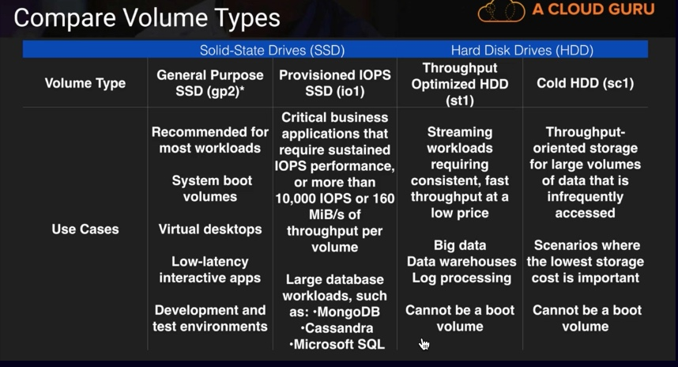
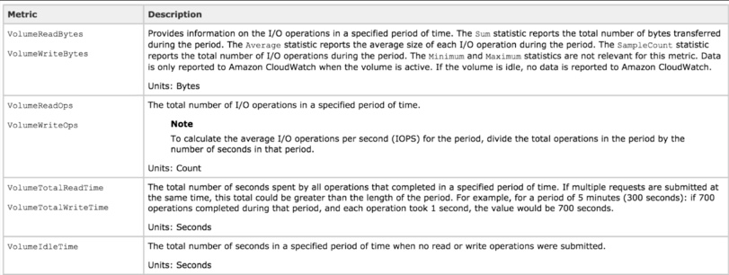
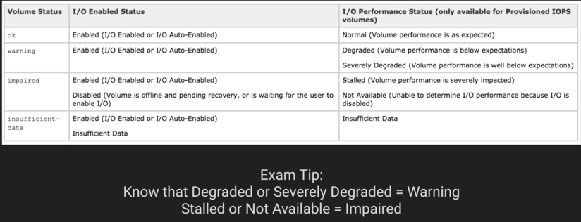
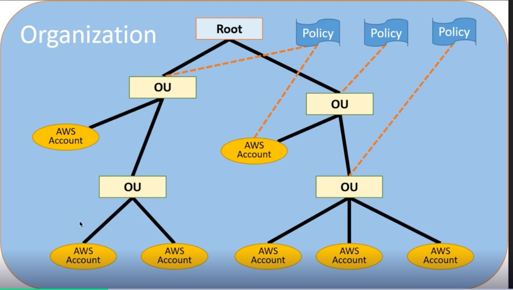

## Documents:
[Exam Blueprint](https://d1.awsstatic.com/training-and-certification/docs-sysops-associate/AWS%20Certified%20SysOps%20-%20Associate_Exam%20Guide_Sep18.pdf)

[AWS exam preparation](https://aws.amazon.com/certification/certification-prep/?sc_icampaign=aware_certification_examprep_uppered_oct&sc_ichannel=ha&sc_icontent=awssm-6110_console-home&sc_iplace=console-home_oneup&trk=~ha_awssm-6110_console-home)

[Initializing Amazon EBS volumes](https://docs.aws.amazon.com/AWSEC2/latest/UserGuide/ebs-initialize.html)

[Monitoring the status of your volumes](https://docs.aws.amazon.com/AWSEC2/latest/UserGuide/monitoring-volume-status.html)

[Monitoring use with Elasticache metrics](https://docs.aws.amazon.com/AmazonElastiCache/latest/red-ug/CacheMetrics.html)

[AWS Config FAQs](https://aws.amazon.com/config/faq/)

| Objective | % of Examination | 
| -------- | -------- | 
|Domain 1: Monitoring and Reporting |22% |
|Domain 2: High Availability |8% |
|Domain 3: Deployment and Provisioning  | 14%|
|Domain 4: Storage and Data Management  |12% |
|Domain 5: Security and Compliance |18% |
|Domain 6: Networking  |14% |
|Domain 7: Automation and Optimization |12% |
|**TOTAL**  |**100%** |

## Monitoring and Reporting

### Cloud Watch
- A cloud watch is a monitroing service to monitor AWS resources,as well as well as applications that run on AWS.

- CloudWatch can monitor things like:
  - Compute
     - Autoscaling groups
     - Elastic Load Balancers
     - Route53 Health Checks
  - Storage and Content Delivery
     - EBS Volumes
     - Storage Gateways
     - CloudFront
  - Databases and Analytics
     - DynamoDB
     - Elasticache Nodes
     - RDS Instances
     - Elastic MapReduce Job Flows
     - Redshift      

  - Other
     - SNS(Simple Notification Service) Topics
     - SQS(Simple Queue Service) Queues
     - Opsworks
     - CloudWatch Logs
     - Estimated charges on your AWS Bill 

  - Host Level Metrics always consists of:
     - CPU
     - Network
     - Disk
     - Status Check

    :sparkles: :sparkles: RAM utilization 
  It is a custom metric! By default EC2 monitoring is 5 minute intervals, unless you enable detailed monitoring which will then make it 1 minute intervals.

    :sparkles: :sparkles: Metric Granularity
   - 1 minute for detailed monitoring
   - 5 minutes for standard monitoring
  
  :sparkles: :sparkles: CloudWatch can be used on premise - Not restricted to just AWS resources. Can be on premise too. Just need to download and install the SSM agent and Cloudwatch agent.

### Monitoring EBS
- EBS Different types of EBS storage;
     - General purpose (SSD) - gp2
     - Provisioned IOPS (SSD) - io1
     - Throughput Optimized (HDD) - st1
     - Cold (HDD) - sc1

       
  
- Pre-Warming EBS Volumes: 
    - New EBS volumes receive their maximum performance the moment that they are available and do not require initialization (formerly known as pre-warming). However, storage blocks on volumes that were restored from snapshots must be initialized(pulled down from amazon S3 and written to the volume) before you can access the block. This preliminary action takes time and can cause a significant increase in the latency of an I/O operation the first time each block is accesses. For most applications, amortizing this cost over the lifetime of the volume is acceptable. Performance is resotred after the data is accessed once.
    - You can avoid this performance hit in a production environment by reading from all of the blocks on your volume before you use it; this process is called intialization. For a new volume created from snapshot, you should read all the blocks that have data before using the volume.

    - EBS CloudWatch Metrics
   

    - Volume Status Checks
      
    
    :sparkles: :sparkles: Volume Read Ops/Volume Write Ops = Total number of IO Ops in a specific period of time. So say 1000 in 1 minute = 1000/60 = IOPS

    :sparkles: :sparkles: Volume Queue Length = Number of read operations and write operation request waiting to be completed in a specific period of time.

### Monitoring ELB
  
- 3 different types of Elastic load balancers;
   - `Application load balancer`
         Choose an Application Load Balancer when you need a flexible feature set for your web applications with HTTP and HTTPS traffic. Operating at the request level, Application Load Balancers provide advanced routing and visibility features targeted at application architectures, including microservices and containers.  
   - `Network load balancer` Choose a Network Load Balancer when you need ultra-high performance, TLS offloading at scale, centralized certificate deployment, support for UDP, and static IP addresses for your application. Operating at the connection level, Network Load Balancers are capable of handling millions of requests per second securely while maintaining ultra-low latencies.
   - `Classic load balancer`
- 4 different ways to monitor your load balancers;
   - `CloudWatch metrics`
      - Elastic Load balanceing publishes data points to Amazon CloudWatch for your load balancers and your targets. CloudWatch enables you to retrieve statistics about those data points as an ordered set of time-series data, known as metrics. Think of a metric as a variable to monitor, and the data points as the values of that variable overtime. For example, you can monitor the total number of healthy targets for a load balancer over a specified time period. Each data point has an associated time stamp and an optional unit of measurement.
   - `Access logs` 
      - Elastic load balancing provides access logs that capture detailed information about requests sent to your load balancer. Each log containes information such as the time the request was received, the cliend IP address, latencies, request paths, and server responses. You can use these access logs to analyze traffic patterns and troubleshoot issues.
      - Access logging is an optional feature of elastic load   balacing that is disabled by default. After you enable access logging for your load balancer, elastic load balacing captures the logs and stores them in the amazon S3 bucket that you specifiy as compresses files. you can disable access logging anytime.
      - Access Logs - **SUPER IMPORTANT**
          Access logs can store data where the EC2 instance has been deleted. For example say you have a fleet of EC2 instances behind an autoscaling group. For some reason your application has a lof of 5xx error which is only reported by your end customers a couple of days after the event. If you arent storing the web server logs anwhere persistent, it is still possible to trace these 5xxx errors using access logs which would be stored on S3.

   - `Request tracing` 
      - You can use request tracing to track HTTP requests from clients to targets or other services. When the load balancer receives a request from a client, it adds or updates the X-Amzn-Trace-Id header before sending the request to the target. ANy services or applications between the load balancer and the target can also add or update this header.`*Available for applications load balancer only*`
  
      - `CloudTrail logs` 
          - You can use AWS CloudTrail to capture detailed information about the calls made to the elastic load balancing API and store them as log files in Amazon S3.You can use these CLoudTrail logs to determine which calls were made the source IP address where the call came from, who made the call, when the call was made, and so on.

       :sparkles: :sparkles: **CloudWatch vs CloudTrail?**
    
     - CloudWatch monitors performance
     - CloudTrail monitors API calls in the AWS platform.(in other terms used for auditing)
### Monitoring Elasticache  
- Elasticache consists of two engines
     - Memcached
     - Redis 

- When it comes to monitoring our caching engines there are 4 important things to look at:
     - CPU Utilization
     - Swap Usage
     - Evictions
     - Concurrent Connections

- CPU Utilization:
     - `Memcached`
         - Multi-threaded
         - Can handle loads of up to 90%. If it exceeds 90% add more nodes to the cluster.
     - `Redis`
         - Not Multi-threaded. To determine the point in which to scale, take 90 and divide by the number of cores.
         - For example, suppose you are using a cache.m1.xlarge node, which has four cores. In this case, the threshold for CPU utilization would be (90/4), or 22.5% 
- Swap Usage:
     - `What is Swap` : Swap is a space on a disk that is used when the amount of physical RAM memory is full. When a Linux system runs out of RAM, inactive pages are moved from the RAM to the `SWAP` space.
     Put simply, swap usage is simply the amount of the swap file that is used. The swap file (or paging file) is the amount of disk storage space reserved on disk if your computer runs out of ram. `Typically the size of the swap file = the size of the RAM.` So if you have 4GB of RAM, you will have 1 4GB Swap file.
     - `Memcached`
        - Should be around 0 most of the time and should not exceed 50MB.
        - If this exceeds 50MB you should increase the memcached_connections_overhead parameter.
        - The memcached_connections_overhead defines the amount of memory to be reserved for memcached connections and other miscellaneous overhead.
     - `Redis`
        - No SwapUsage metric, instead use reserved-memory
- Evictions:
   - Think of evictions like tenants in an appartment building. There are a number of empty appartments that slowly fill up with tenants. Eventually the appartment block is full, however more tenants need to be added.
   An eviction occurs when a new item is added and an old item must be removed due to lack of free space in the system.
   - `Memcached`
        - There is no recommended setting. Choose a threshold based off your application.
        - Either scale Up (ie increase the memory of existing nodes) OR 
        - Scale Out (add more ndoes) 
   - `Redis`
        - There is no recommended setting. Choose a threshold based off your application.
        - Only Scale Out(add read replicas)  
  
   :sparkles: :sparkles: Exam TIP: differenct approaches between Memcached and Redis
- Concurrent Connections:
   -  Memcached & Redis
        - There is no recommended setting. Choose a threshold based off your application.
        - If there is a large and sustained spike in the number of concurrent connections this can either mean a large traffic spike OR your appliction is not releasing connections as it should be
  
   :sparkles: :sparkles: Exam TIP :Remeber to set an alarm on the number of concurrent connections for elasticache.

   :sparkles: :sparkles: `ClouWatch` dashboards are multi-region and can display any widget to any region. To add the widget, change to the region that you need and then add the widget to the dashboard.

### AWS Organizations
  
- AWS Organizations allows you to manage multiple AWS accounts at once. With Organizations, you can create groups of accounts and then apply policies to those groups.
- Centrally manage policies across multiple AWS accounts.
- Control Access to AWS services using `Service Control Policies (SCP)`.
- Automate AWS account creation and management.
- Consolidate billing across multiple aws accounts.
  

### Tagging and Resource Groups
- What are Tags?
   - Key value pairs attached to AWS resources
   - Metadata (data about data)
   - Tags can sometimes be inherited
      - Autoscaling, CloudFormation, and Elastic Beanstalk can create other resources.
- What are resource groups?
   - Resource groups make it easy to group your resources using the tags that are assigned to them. You can group resources that share one or more tags.
   - Resource groups contain information such as;
       - Region
       - Name
       - Health Checks
   - Specific information
       - For EC2 - Public and private IP addresses
       - For ELB - Port configurations
       - For RDS - Database engine etc 
   - You can use resource groups with `AWS Systems Manager` to automate tasks.
  
### AWS Cost Explorer and Cost Allocation Tags
- Cost Explorer
    Cost Explorer is a tool that enables you to view and anlyze your costs and usage. You can explore your usage and costs using the main graph, the Cost Explore cost and usage reports, or the cost explorer RI reports. You can view data for up to the last 13 months, forecast how much you're likely to spend for the next three months, and get recommendations for what reserved instances to purchase. You can use cost explore to identify areas that need further inquiry and see trends that you can use to understand your costs.
    - Use tags to tag your resources.
    - Configure tags for cost centres(such as by department, employee id etc)
    - Activate cost allocation tags to track your costs by tags
  
### EC2 Pricing Models
- On Demand
    - Users that want the low cost and flexibility of amazon EC2 without any upfront payment or long term commitment.
    - Application with short term, spiky, or unpredictable workloads that cannot be interrupted.
    - Applications being developed or tested on Amazon EC2 for the first time.
- Reserved
    - Applications with steady state or predictable usage.
    - Applications that require reserved capacity.
    - Users able to make upfront payments to reduce their total computing costs even further
      - Standard RI's (Up to 75% off on demand)
      - Convertible RI's (Up to 54% off on demand) capability to change the attributes of the RI as long as the exchange results in the creation of reserved instances of equal or greater value.
      - Scheduled RI's available to launch within the time windows your reserve. This option allows you to match your capacity reservation to a predicatble recurring schedule that only requires a fraction of a day, a week, or a month.  
- Spot
    -  Applications that have flexible start and end times
    -  Applications that are only feasible at very low compute prices.
    -  Users with urgent computing needs for large amounts of additional capacity.
- Dedicated Hosts
    - Useful for regulatory requirements that may not support multi-tenant virtualization.
    - Great for licensing which doesn not support multi-tenancy or could deployments.
    - Can be purchased On-Demand (hourly).
    - Can be purchased as a reservation for up to 70% off the on-demand price.

### AWS Config
- AWS Config is a fully managed service that provides you with an AWS resource inventory, configuration history, and configuration change notifications to enable security and governance.
   - Enables:
      - Compliance auditing
      - Security analysis
      - Resource tracking
  - Provides:
      - Configuration snapshots and logs config changes of AWS resources
      - Automated complaince checking   
- Key components:
   - Config dahsboard
   - Config Rules
      - Managed
      - Custom
   - Resources
   - Settings   
- Terminology:
   - Configuration `Items`
      - Point -in-time attributes of resource
   - Configuration `snapshots` 
      - Collection of config items
   - Configuration `stream`
      -  Stream of changes config items
   - Configuration `History`
      - Colelction of config items for a resource over time
   - Configuration `Recorder`
      - The configuration of config that records and stores config items.   
      - Recorder Setup
         - Logs config for account in region
         - Store in S3
         - Notifies SNS 
- Compliance checks:
   - Trigger
       - Periodic
       - Configuration snapshot delivery (filterable) 
   - Managed Rules
       - About 125 (at the time of recording)
       - Basic, but fundamental 

:sparkles: :sparkles: CloudWatch VS CloudTrail vs Config
   - CloudWatch monitors performance.
   - CloudTrail monitors API calls in the AWS platfrom.
   - AWS Config records the state of your AWS environment and can notify you of changes.