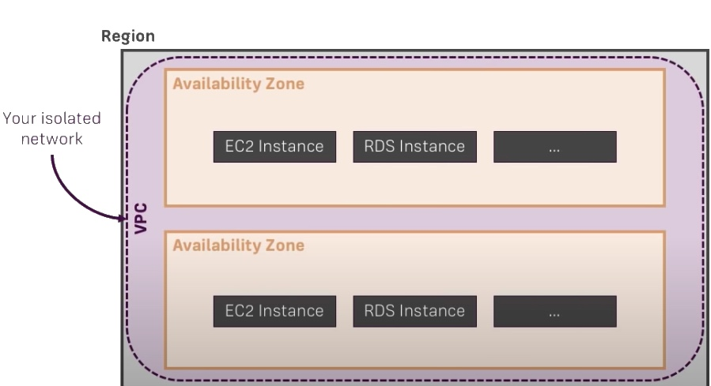

# How to setup the accounts, regions, AZ, VPC, Subnets, NAT Gateway?

## VPC
### What is VPC(Virtual Private Cloud)?

- VPC is isolated network in a region
- VPCs are created in regions, while creating VPC need to decide which region to use

##### Why do you want to isolate VPC, 
 - Is it shared with other customers of AWS ?Nope
 - Isolation means, we can manage multiple networks on your account isolated from each others
    

#### Create VPC:
 - Step 1: Search for VPC dahsboard
 - Step 2: We will have four templates
      - VPC with a single public subnet
      - VPC with Public and Private subnets
      - VPC with Public and private subnets and Hardware VPN access
      - VPC with a private subnet only and hardware VPN access
        
  what is CIDR block : That is a notation for IP address ranges   
  Example : 10.0.0.0/26
  start IP address : 10.0.0.0
  2 ^ (32-26) = 2 ^ 6 = 64
  End IP : 10.0.0.63

### Subnet
  - Subnets are subnetworks inside VPC and each subnet can be in one availability zone

  

##### Public and Private subnets:
- By default subnet is a subnet, we can create public or private one.
- We can change the characterstics of subnet to make it private or public

### Security Groups
- Security groups acts as firewall
- Security groups are one way of controlling which access is allowed to instances and which traffic may leave instances.
- Security groups can be setup at VPC level and then can be applied at per instance level.

### NACL(Network Access Control List):
- NACL are applied at subnet level
- Which traffic may enter subnet

 ### Internet Gateway:
 - Internet gateway is a entitiy which allows route from VPC to outside internet
 - Only one Internet Gateway can be atatched to VPC
 ### Route Table:
- Controls routing of outgoing network requests.
- Block outgoing traffic(to internet) or Allow it
- One subnet can have one route table
- One route table can be associated to multiple subnets

### NAT Gateway:
- NAT gateway is a service managed by AWS
- NAT stands for Network Address transalation, it translates internal ips into public ones so that NAT gateway has a public IP. Now we are able to access internet indirectly with our private instances.

