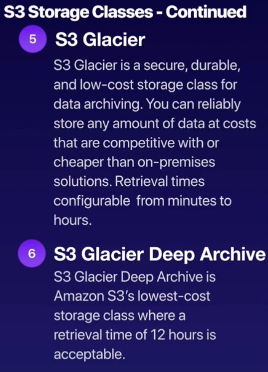
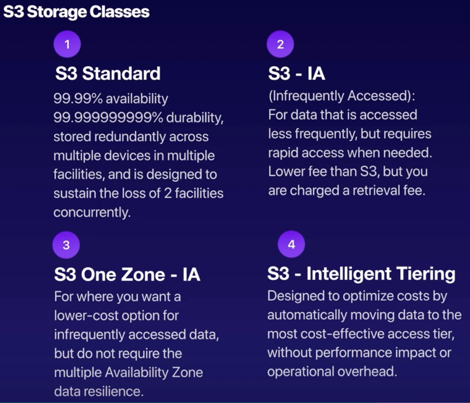

# AWS Certified Solutions Architect - Associate
###### tags: `Certifications`

## IAM

- **Key Features of IAM**
     - Centralised control of your AWS account
     - Shared Access to your AWS account
     - Granular permissions
     - Identity Federation (INcluding Active directory, Facebook, Linkedin etc)
     - Multifactor Authentication
     - Provide temporary access for users/devices and services where necessary.
     - Allows you to set up your own password rotation policy
     - Integrates with many different AWS services
     - Supports PCI DSS compliance.

- **Key Terminology for IAM**
     - **Users** : End users such as people, employees of an organization etc.
     - **Groups** : A collection of users. Each user in the group will inherit the permissions of the group.
     - **Policies** : Policies are made up of documents, called policy documents. These documents are in a format called JSON and they give permissions as to what a User/Group/Role is able to do.
     - **Roles** : You create roles and then assign them to AWS Resources.

- **IAM Roles**?
     IAM roles are a secure way to grant permissions to entities that you trust.Examples of entities include the following:
     - IAM user in another account
     - Application code running on an EC2 instance that needs to perform actions on AWS resources.
     - An AWS service that needs to act on resources in your account to provide its features.
     - Users from a corporate directory who use identity federation with SAML
     - IAM roles issue keys that are valid for short durations, making them a more secure way to grant access.
- **Different MFA devices for Multifactor authentication:**
    - **Virtual MFA device** : Authentication app installed on your mobile device or computer
    - **U2F security key**: Yubikey or any other compliant U2F device.
    - **Other hardware MFA device** : Gemalto token

- **Points to be aware off:**
   - IAM is Global(not specific to any region)
   - New Users have NO permissions when first created.
   
## S3
- S3
    - S3 is Object-based - i.e allows you to upload files.
    - Files can be from 0 Bytes to 5 TB.
    - There is unlimited storage.
    - Files are stored in Buckets.
    - S3 is **Universal Namespace**
    - When you upload a dile to S3, you will receive a **HTTP 200** code if the upload was successfull.
- How does data consistency work for S3?
    - Read after write consistency for PUTS of new Objects.
    - Eventually consistency for overwrite PUTS and DELETES (can take some time to propagate)

- S3 has the following gurantess from Amazon:
    - Built for 99.99% availability for the S3 platform.
    - Amazon gurantee 99.9% availability.
    - Amazon gurantees 99.9999999% durability for S3 information.(11x9's).

- S3 Storage class
 
 
 
- You are charged for S3 in the following ways:
    - Storage
    - Requests
    - Storage Management Pricing
    - Data Transfer Pricing
    - Transfer Acceleration
    - Cross Region Replication Pricing

- Restricting Bucket Access
    - Bucket policies: Applies across the whole bucket
    - Object Policies: Applies to individual files.
    - IAM Policies to Users & Groups: Applies to Users & Groups.

- S3 What Drives the price?

- Understand how to get the best value out of S3

- S3 Security and Encryption : 
    - Encryption in transit is achieved by
        - SSL/TLS
    - Encryption At Rest (Server Side) is achieved by
        - S3 Managed Keys - SSE-S3
        - AWS Key Management Service, Managed Keys - SSE-KMS
        - Server Side encryption with customer provided keys - SSE-C
    - Client Side Encryption
- S3 Life Cycle Management:
    - Automates moving your objects between the different storage tiers.
    - Can be used in conjunction with versioning.
    - Can be applied to current versions and previous versions.

### References:
[How I passed my SAA-C02 with zero experience within two months](https://towardsdatascience.com/how-i-passed-the-aws-certified-solutions-architect-saa-c02-with-zero-experience-within-two-months-ecc3fa5c1d28)

